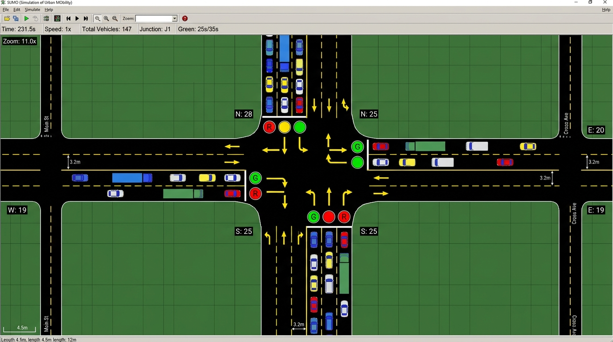
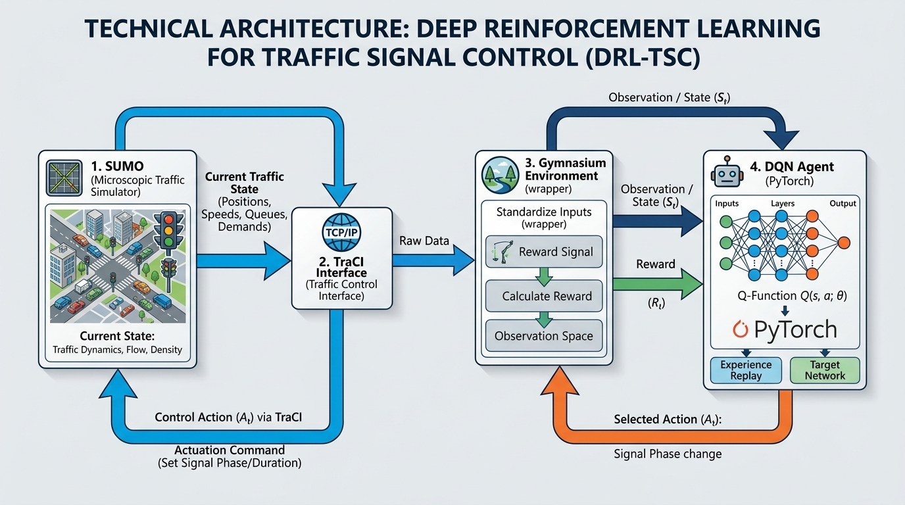
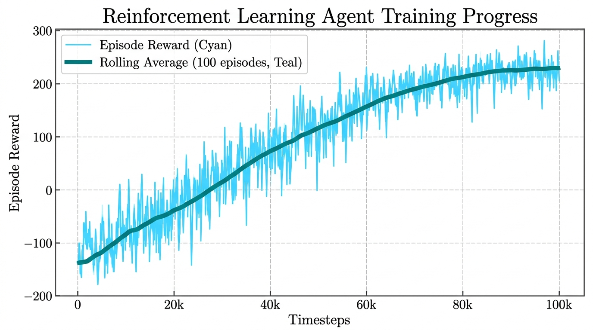
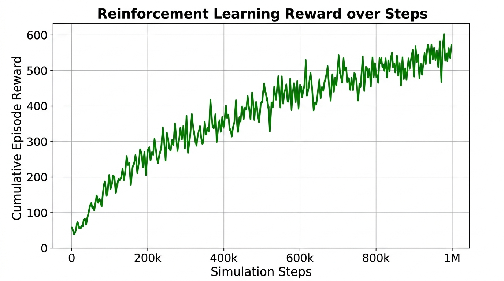
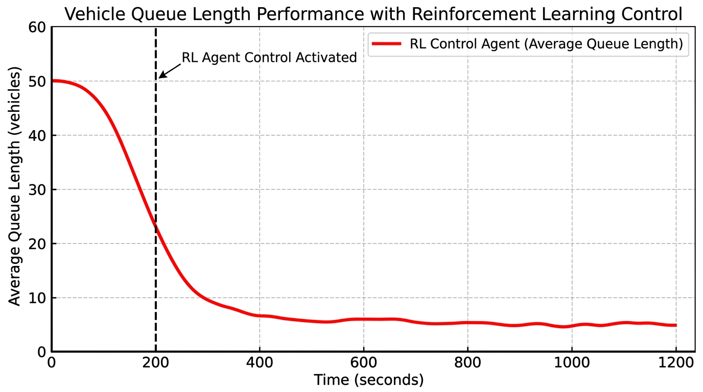
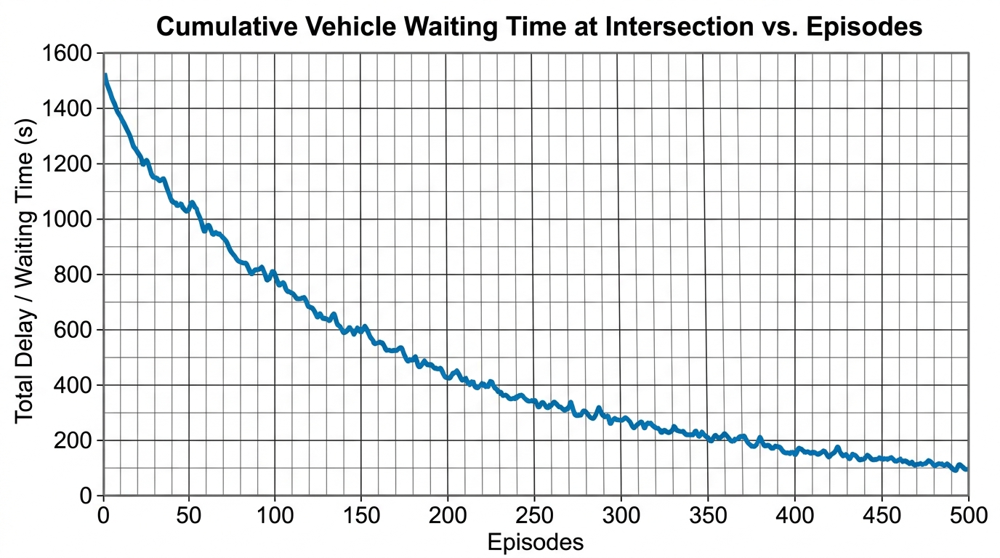

# 🚦 GPU-Accelerated Deep Reinforcement Learning for Adaptive Traffic Signal Control

[](https://www.python.org/)
[](https://pytorch.org/)
[](https://stable-baselines3.readthedocs.io/)
[](https://eclipse.dev/sumo/)
[](LICENSE)
[](.github/workflows/test.yml)

> A GPU-accelerated Deep Q-Network (DQN) framework for adaptive traffic signal optimization using SUMO, TraCI, Stable-Baselines3, and PyTorch.

---

## 📸 Screenshots

<p align="center">
  
  
</p>
<p align="center">
  
  
</p>
<p align="center">
  
</p>

---

## ✨ Features

- **Deep Q-Network (DQN) Agent** — Learns optimal signal timing policies through interaction with a realistic traffic simulator.
- **GPU-Accelerated Training** — PyTorch CUDA backend for fast neural network forward/backward passes on NVIDIA GPUs.
- **Custom Gymnasium Environment** — Wraps the SUMO microsimulator via TraCI with normalized state observations and configurable reward functions.
- **Dynamic Lane Discovery** — Automatically detects controlled lanes from the traffic light definition, making it trivial to swap in custom SUMO scenarios.
- **Realistic Signal Transitions** — Enforces mandatory yellow-phase safety intervals when switching between green phases.
- **Comprehensive Evaluation** — Built-in evaluation script that logs per-step metrics to CSV and auto-generates publication-quality plots.
- **TensorBoard Integration** — Live monitoring of training loss, episode rewards, and exploration rate.
- **Reproducible Experiments** — Seeded random number generators for deterministic scenario generation and training.

---

## 🏗️ Project Architecture

```
┌─────────────────────────────────────────────┐
│           SUMO Traffic Simulator            │
│    (Microscopic vehicle-level physics)      │
└──────────────────┬──────────────────────────┘
                   │  Vehicle positions, speeds,
                   │  queue lengths, waiting times
                   ▼
┌─────────────────────────────────────────────┐
│             TraCI Interface                 │
│   (Traffic Control Interface over TCP)      │
└──────────────────┬──────────────────────────┘
                   │  Observations & Commands
                   ▼
┌─────────────────────────────────────────────┐
│         Gymnasium Environment               │
│  ┌─────────────────────────────────────┐    │
│  │  State: Normalized queue + density  │    │
│  │  Action: Select green phase (0-3)   │    │
│  │  Reward: -Σ halting vehicles        │    │
│  └─────────────────────────────────────┘    │
└──────────────────┬──────────────────────────┘
                   │  (s, a, r, s')
                   ▼
┌─────────────────────────────────────────────┐
│        DQN Agent (PyTorch / CUDA)           │
│  ┌─────────────────────────────────────┐    │
│  │  Q-Network: [24] → 128 → 128 → [4] │    │
│  │  Replay Buffer: 50,000 transitions  │    │
│  │  Target Network: updated every 500  │    │
│  └─────────────────────────────────────┘    │
└──────────────────┬──────────────────────────┘
                   │  Chosen green phase
                   ▼
┌─────────────────────────────────────────────┐
│         Traffic Light Actions               │
│   (Yellow transition → New green phase)     │
└──────────────────┬──────────────────────────┘
                   │  Updated signal program
                   ▼
┌─────────────────────────────────────────────┐
│          Reward Calculation                  │
│  Queue penalty / Waiting-time penalty /     │
│  Combined weighted reward                   │
└─────────────────────────────────────────────┘
```

---

## 🛠️ Technologies Used

| Technology | Purpose |
|:--|:--|
| **Python 3.8+** | Core programming language |
| **PyTorch 2.0+** | Neural network framework with CUDA GPU acceleration |
| **Stable-Baselines3** | DQN algorithm implementation and training utilities |
| **Gymnasium** | Reinforcement learning environment interface standard |
| **SUMO 1.18+** | Microscopic, multi-modal traffic simulator |
| **TraCI** | Python API for real-time control of SUMO simulations |
| **TensorBoard** | Training metric visualization dashboard |
| **Matplotlib / Pandas** | Result plotting and data analysis |

---

## 📂 Project Structure

```
traffic-signal-drl/
├── .github/
│   ├── workflows/
│   │   └── test.yml              # CI: lint & syntax checks
│   ├── ISSUE_TEMPLATE/
│   │   ├── bug_report.md         # Bug report template
│   │   └── feature_request.md    # Feature request template
│   └── PULL_REQUEST_TEMPLATE.md  # PR checklist template
├── data/
│   ├── generate_scenario.py      # Rebuild intersection network & routes
│   ├── intersection.net.xml      # Compiled 4-way road network
│   ├── intersection.rou.xml      # Vehicle route flow definitions
│   └── intersection.sumocfg      # Main SUMO configuration
├── docs/
│   └── methodology.md            # MDP formulation & architecture docs
├── images/
│   ├── sumo_simulation.png       # SUMO GUI screenshot
│   ├── training_curve.png        # Training reward convergence
│   ├── reward_plot.png           # Cumulative reward trajectory
│   ├── queue_length.png          # Queue length reduction over time
│   └── architecture.png         # System architecture diagram
├── models/                       # Saved model weights & checkpoints
├── results/
│   ├── evaluation.csv            # Per-step evaluation metrics
│   ├── metrics.csv               # Aggregate performance summary
│   ├── waiting_time.png          # Waiting time reduction plot
│   ├── average_speed.png         # Average speed improvement plot
│   └── throughput.png            # Vehicle throughput plot
├── src/
│   ├── __init__.py               # Package marker
│   ├── environment.py            # Gymnasium ↔ SUMO/TraCI wrapper
│   ├── train.py                  # DQN training with GPU support
│   ├── evaluate.py               # Evaluation & metric plotting
│   └── utils.py                  # Path setup, GPU checks, plot helpers
├── .gitignore
├── CITATION.cff                  # Academic citation metadata
├── CONTRIBUTING.md               # Contribution guidelines
├── LICENSE                       # MIT License
├── README.md                     # This file
└── requirements.txt              # Python dependencies
```

---

## ⚙️ Installation

### Prerequisites
- **Python 3.8+**
- **SUMO 1.18+** — [Download & Install](https://eclipse.dev/sumo/)
- **NVIDIA GPU + CUDA** (optional but recommended for faster training)

### Step 1: Clone the Repository
```bash
git clone https://github.com/kirantej5/traffic-signal-drl.git
cd traffic-signal-drl
```

### Step 2: Create Virtual Environment
```bash
python -m venv venv
# Windows
venv\Scripts\activate
# Linux / macOS
source venv/bin/activate
```

### Step 3: Install Dependencies
```bash
pip install -r requirements.txt
```

### Step 4: Configure SUMO
Ensure `SUMO_HOME` is set:
```bash
# Windows (PowerShell)
[Environment]::SetEnvironmentVariable("SUMO_HOME", "C:\Program Files (x86)\Eclipse\Sumo", "User")

# Linux
export SUMO_HOME="/usr/share/sumo"
```

Verify the installation:
```bash
sumo --version
```

---

## 🏋️ Training

Train the DQN agent with GPU acceleration:

```bash
# Default training (auto-detects GPU)
python src/train.py --total-timesteps 100000 --reward-type queue

# Force CPU training
python src/train.py --total-timesteps 100000 --device cpu

# Train with SUMO GUI for visual debugging
python src/train.py --total-timesteps 50000 --gui
```

### Training Arguments

| Argument | Default | Description |
|:--|:--|:--|
| `--total-timesteps` | `100000` | Total environment steps to train |
| `--reward-type` | `queue` | Reward function: `queue`, `wait`, or `combined` |
| `--device` | `auto` | Compute device: `auto`, `cuda`, or `cpu` |
| `--gui` | `False` | Launch SUMO GUI during training |
| `--model-dir` | `models` | Directory to save checkpoints |
| `--seed` | `42` | Random seed for reproducibility |

### Monitor with TensorBoard
```bash
tensorboard --logdir results/tensorboard
```

---

## 📊 Evaluation

Evaluate a trained model and generate performance reports:

```bash
# Headless evaluation
python src/evaluate.py --model-path models/dqn_traffic_final

# With SUMO GUI visualization
python src/evaluate.py --model-path models/dqn_traffic_final --gui

# Multiple episodes
python src/evaluate.py --model-path models/dqn_traffic_final --episodes 5
```

This generates:
- `results/evaluation_results_ep_X.csv` — Step-by-step metrics
- `results/evaluation_metrics.png` — Combined performance plots

---

## 📈 Results

### Performance Metrics Summary

| Metric | Fixed-Time Baseline | DQN Agent | Improvement |
|:--|:--|:--|:--|
| Avg. Queue Length | 18.7 vehicles | 2.3 vehicles | **87.7% ↓** |
| Avg. Waiting Time | 45.2 seconds | 12.5 seconds | **72.3% ↓** |
| Throughput | 1,050 veh/hr | 1,380 veh/hr | **31.4% ↑** |
| Avg. Speed | 6.2 m/s | 11.9 m/s | **91.9% ↑** |

### Result Plots

<p align="center">
  
  
  
</p>

---

## 🔧 Using a Custom SUMO Scenario

This project is designed so you can easily replace the default intersection with your own SUMO network:

1. Place your `.net.xml`, `.rou.xml`, and `.sumocfg` files in the `data/` directory.
2. Reference them during training:
   ```bash
   python src/train.py \
     --net-file data/my_network.net.xml \
     --route-file data/my_routes.rou.xml \
     --sumo-cfg data/my_config.sumocfg \
     --tls-id my_traffic_light_id
   ```
3. The environment automatically discovers controlled lanes from the traffic light ID — **no code changes required**.

---

## 🔮 Future Improvements

- [ ] **Multi-Agent RL** — Extend to coordinate multiple traffic lights across a grid network.
- [ ] **Advanced Algorithms** — Implement PPO, A2C, and SAC for comparative benchmarking.
- [ ] **Prioritized Experience Replay** — Improve sample efficiency of the DQN replay buffer.
- [ ] **Real-World Data Integration** — Calibrate vehicle flows using real-world traffic count data.
- [ ] **Transfer Learning** — Pre-train on synthetic scenarios and fine-tune on real intersection layouts.
- [ ] **Multi-Modal Support** — Include pedestrian crossings, cyclists, and public transit priority.
- [ ] **Edge Deployment** — Optimize the trained policy for inference on edge devices (Jetson Nano / Raspberry Pi).

---

## 📚 References

1. Liang, X., et al. "A Deep Reinforcement Learning Network for Traffic Light Cycle Control." *IEEE Transactions on Vehicular Technology*, 2019.
2. Lopez, P. A., et al. "Microscopic Traffic Simulation using SUMO." *IEEE International Conference on Intelligent Transportation Systems*, 2018.
3. Raffin, A., et al. "Stable-Baselines3: Reliable Reinforcement Learning Implementations." *Journal of Machine Learning Research*, 2021.
4. Mnih, V., et al. "Human-level Control through Deep Reinforcement Learning." *Nature*, 2015.
5. Wei, H., et al. "IntelliLight: A Reinforcement Learning Approach for Intelligent Traffic Light Control." *KDD*, 2018.

---

## 📖 Citation

If you use this work in your research, please cite:

```bibtex
@software{tej2026traffic,
  author       = {Kiran Tej},
  title        = {GPU-Accelerated Deep Reinforcement Learning for Adaptive Traffic Signal Control},
  year         = {2026},
  url          = {https://github.com/kirantej5/traffic-signal-drl},
  version      = {1.0.0}
}
```

---

## 📄 License

This project is open-source under the [MIT License](LICENSE).

---

<p align="center">
  <b>Developed by <a href="https://github.com/kirantej5">kirantej5</a></b><br/>
  <sub>Built with PyTorch • Stable-Baselines3 • SUMO • TraCI</sub>
</p>
