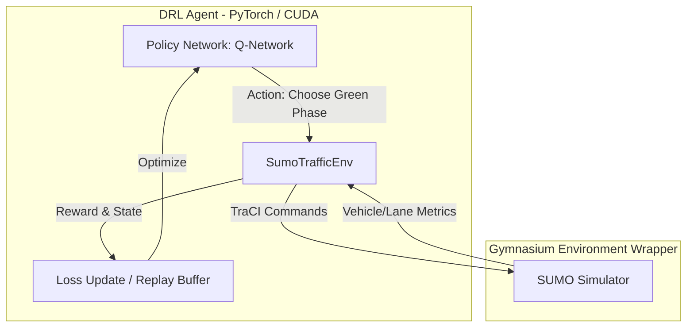

# Methodology: GPU-Accelerated Deep Reinforcement Learning for Adaptive Traffic Signal Control

This document describes the technical architecture, mathematical formulation, and simulation details of the Adaptive Traffic Signal Control (ATSC) project.

---

## 1. Problem Statement

Traditional traffic signal control systems use fixed-time or pre-timed schedules optimized for historical average traffic counts. However, real-world traffic patterns are highly dynamic, leading to severe congestion, increased travel delays, and unnecessary vehicle emissions during off-peak hours. 

Adaptive Traffic Signal Control (ATSC) dynamically adjusts signal timings based on real-time traffic states. In this project, we model the ATSC problem as a **Markov Decision Process (MDP)** and solve it using Deep Reinforcement Learning (DRL).

---

## 2. System Architecture

The system consists of three main components:
1. **Microscopic Traffic Simulator (SUMO)**: Simulates individual vehicle movements, lanes, junctions, and traffic lights.
2. **Gymnasium Environment Wrapper**: Interfaces with SUMO via TraCI (Traffic Control Interface), processing simulation states into features and executing agent decisions.
3. **DRL Agent (Stable-Baselines3 / PyTorch)**: Computes the optimal control policy using a Deep Q-Network (DQN) accelerated by GPU (CUDA).



---

## 3. MDP Formulation

We formulate the single-intersection traffic signal control as an MDP with the tuple $(S, A, P, R, \gamma)$:

### State Space ($S$)
To represent traffic conditions accurately, we extract features for each of the $N$ incoming lanes controlled by the junction. For a standard 4-way intersection with 3 lanes per arm (Left, Straight, Right/Straight), there are $N = 12$ incoming lanes.

For each lane $i$, the state vector contains:
1. **Normalized Queue Length ($q_i$)**: The count of halting vehicles (speed $< 0.1 \text{ m/s}$) divided by the maximum vehicle capacity of the lane:
   $$q_i = \min\left(1.0, \frac{\text{HaltingVehicles}_i}{\text{LaneLength}_i / 7.5}\right)$$
2. **Normalized Vehicle Density ($d_i$)**: The total count of vehicles in the lane divided by capacity:
   $$d_i = \min\left(1.0, \frac{\text{TotalVehicles}_i}{\text{LaneLength}_i / 7.5}\right)$$

The observation space is a continuous vector $s \in \mathbb{R}^{24}$.

### Action Space ($A$)
The agent chooses from 4 discrete actions, each corresponding to a specific non-conflicting green phase configuration:
* **Action 0**: North-South Straight & Right Green
* **Action 1**: North-South Left-Turn Green
* **Action 2**: East-West Straight & Right Green
* **Action 3**: East-West Left-Turn Green

#### Yellow Phase Transition Logic
For safety and realism, if the agent selects a green phase different from the currently active phase, a **yellow transition phase** of $t_{\text{yellow}} = 4$ seconds is executed before switching to the target green phase. This prevents sudden emergency stops and matches real-world signal operations.

### Reward Function ($R$)
We support multiple reward function designs:
1. **Queue Penalty (Default)**: Penalizes the total number of halting vehicles:
   $$R_t = -\sum_{i=1}^{N} \text{HaltingVehicles}_{i}$$
2. **WaitingTime Penalty**: Penalizes the total time vehicles have spent waiting:
   $$R_t = -\sum_{i=1}^{N} \text{WaitingTime}_{i}$$
3. **Combined Reward**: A weighted linear combination of queues and delay:
   $$R_t = - \left( 0.5 \sum_{i=1}^{N} q_i + 0.01 \sum_{i=1}^{N} w_i \right)$$

---

## 4. Deep Q-Network (DQN) Algorithm

The agent uses a Deep Q-Network to approximate the optimal action-value function $Q^*(s, a)$, which represents the expected cumulative discounted reward of taking action $a$ in state $s$:

$$Q^*(s, a) = \mathbb{E} \left[ R_t + \gamma \max_{a'} Q^*(s_{t+1}, a') \mid s_t=s, a_t=a \right]$$

### Neural Network Structure
* **Input Layer**: 24 neurons (state vector)
* **Hidden Layers**: Fully connected layers (`[128, 128]` neurons) with ReLU activation
* **Output Layer**: 4 neurons (estimated Q-value for each phase action)

### GPU Acceleration Setup
The neural network computations (forward passes for action prediction, backward passes for parameter updates) are mapped to the **NVIDIA CUDA GPU**. Since PyTorch coordinates the gradient steps, GPU acceleration speeds up the training loop dramatically compared to CPU-only operations.

```
+-------------------------------------------------------+
|                 PyTorch Training Loop (GPU)           |
|                                                       |
|  [Replay Buffer] --> [Batch Loader] --> [CUDA Device] |
|                                               |       |
|                                        Gradient Step  |
|                                               v       |
|  [Action Selection] <-- [Q-Network] <---------+       |
+-------------------------------------------------------+
                           |
                     (CPU-GPU Boundary)
                           |
                           v
+-------------------------------------------------------+
|                 SUMO Simulator (CPU)                  |
|                                                       |
|   Step simulation --> Update positions --> TraCI API  |
+-------------------------------------------------------+
```

---

## 5. References

1. Liang, X., et al. "A Deep Reinforcement Learning Network for Traffic Light Cycle Control." *IEEE Transactions on Vehicular Technology*, 2019.
2. Lopez, P. A., et al. "Microscopic Traffic Simulation using SUMO." *IEEE International Conference on Intelligent Transportation Systems*, 2018.
3. Raffin, A., et al. "Stable-Baselines3: Reliable Reinforcement Learning Implementations." *Journal of Machine Learning Research*, 2021.
